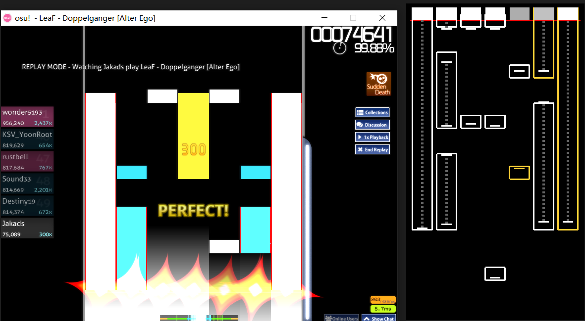
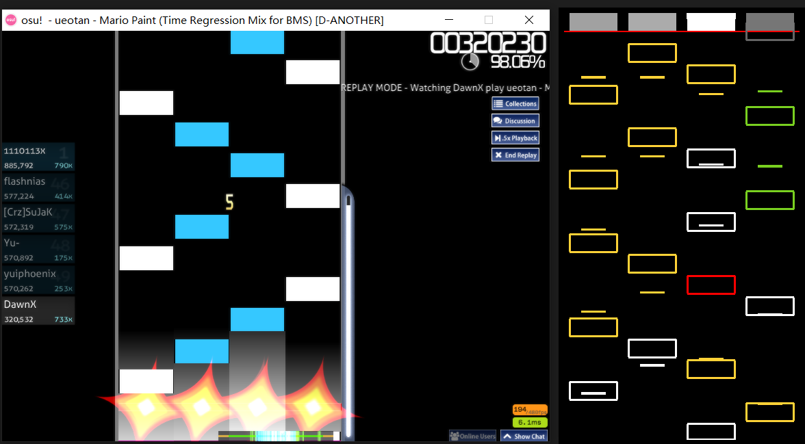

# ManiaRTRender

[English Version](README_EN.md)

## 这是啥？

ManiaRTRender是一个[OsuSync](https://github.com/Deliay/osuSync)的可视化插件，用于在音乐游戏osu!mania中实时标记判定和打击位置。功能与[ManiaReplayMaster](https://github.com/Keytoyze/Mania-Replay-Master)类似。与MRM不同的是，这是一个实时渲染工具。无需使用回放文件作为输入，打开工具开始游戏就可以进行在线的渲染。

演示：[[O!M] 实时渲染演示：Jakads - Last Resort (10.24*) 99.70%](https://www.bilibili.com/video/BV1vE411c73P)

### 截图

## 安装方法

1. 安装[OsuSync](https://github.com/Deliay/osuSync)。

2. 安装[OsuRTDataProvider](https://github.com/OsuSync/OsuRTDataProvider)。根据提示，下载最新版本（要求至少`1.6.1`版本），覆盖安装到OsuSync即可。

3. 下载[ManiaRTRender](https://github.com/Keytoyze/ManiaRTRender/releases)。解压后，同样覆盖安装到OsuSync中的Plugins文件夹中。

4. 打开Sync.exe。

## 配置方法

ManiaRTRender支持修改下落速度、背景图片、渲染帧数以及UI元素尺寸。可以直接修改{OsuSync}/config.ini文件（位于`[ManiaRTRender.SettingIni]`配置项）。也可以使用ConfigGUI插件，用图形界面进行修改。

|配置名|默认值|备注
|-|-|-
|Speed|25|下落速度（建议不要过大）
|BackgroundPicture||游戏未开始时的背景图片（为空则显示默认背景）
|FPS|0|渲染帧数（为0则开启垂直同步）
|NoteHeight|40|note高度
|HitHeight|5|打击位置高度
|NoteStrokeWidth|3|note边框宽度

## TourneyMode（测试中）

请参考[OsuRTDataProvider](https://github.com/OsuSync/OsuRTDataProvider)中关于TourneyMode的介绍。修改OsuRTDataProvider的Tourney相关配置即可。

## LICENSE

[GNU General Public License v3.0](https://github.com/Keytoyze/ManiaRTRender/blob/master/LICENSE)
