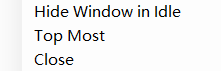

# ManiaRTRender

[](https://github.com/Keytoyze/ManiaRTRender/releases/latest)
[](https://github.com/Keytoyze/ManiaRTRender/releases)
[](https://github.com/Keytoyze/ManiaRTRender/graphs/contributors)
[](https://github.com/Keytoyze/ManiaRTRender/blob/master/LICENSE)

[English Version](README_EN.md)

## 这是啥？

ManiaRTRender 是一个 [OsuSync](https://github.com/Deliay/osuSync) 的可视化插件，用于在音乐游戏osu!mania中实时标记判定和打击位置。功能与 [ManiaReplayMaster](https://github.com/Keytoyze/Mania-Replay-Master) 类似。与 MRM 不同的是，这是一个实时渲染工具。无需使用回放文件作为输入，打开工具开始游戏就可以进行在线的渲染。

演示：[[O!M] 实时渲染演示：Jakads - Last Resort (10.24*) 99.70%](https://www.bilibili.com/video/BV1vE411c73P)

### 截图


## 安装方法

### 自动安装
1. 安装[OsuSync](https://github.com/Deliay/osuSync)。
2. 打开Sync.exe，输入指令
```
plugins install ManiaRTRender
plugins update
```

### 手动安装

1. 安装 [OsuSync](https://github.com/Deliay/osuSync)。

2. 安装 [OsuRTDataProvider](https://github.com/OsuSync/OsuRTDataProvider)。根据提示，下载最新版本，覆盖安装到OsuSync即可。

3. 下载 [ManiaRTRender](https://github.com/Keytoyze/ManiaRTRender/releases)。解压后，同样覆盖安装到 OsuSync 中的 Plugins 文件夹中。

4. 打开 Sync.exe。

## 右键菜单
右键渲染器将会弹出功能菜单，如下：



- Hide Window in Idle：选中后，将会在游戏未开始时隐藏整个窗口，在开始后重新显示。
- Top Most：选中后，渲染器将会保持在屏幕最顶部。
- Close：关闭渲染器窗口。注意：此操作不可逆，关闭后需要重启Sync.exe才能重新打开渲染器窗口。

## 配置方法

ManiaRTRender 支持修改下落速度、背景图片、渲染帧数以及 UI 元素尺寸。可以直接修改 {OsuSync}/config.ini 文件（位于 `[ManiaRTRender.SettingIni]` 配置项）。也可以使用 ConfigGUI 插件，用图形界面进行修改。

|配置名|默认值|备注
|-|-|-
|Speed|25|下落速度（建议不要过大）
|BackgroundPicture||游戏未开始时的背景图片路径（为空则显示默认背景）
|BackgroundPictureInPlaying||游戏开始时的背景图片路径（为空则为黑色）
|FPS|0|渲染帧数（为 0 则开启垂直同步）
|NoteHeight|40|note高度
|HitHeight|5|打击位置高度
|NoteStrokeWidth|3|note边框宽度
|RateSmoothFactor|0.8|游戏速率变化平滑因子（范围：0~1，越高则表示下落速度越稳定，但更难改变）

> 提示：将 BackgroundPicture 设为纯色图片，之后在 OBS 等直播软件中调整透明色为该颜色，即可实现游戏结束自动隐藏、游戏开始自动显示的效果。

## TourneyMode

请参考 [OsuRTDataProvider](https://github.com/OsuSync/OsuRTDataProvider) 中关于 TourneyMode 的介绍。修改 OsuRTDataProvider 的 Tourney 相关配置即可。

## 编译方法
```bash
git clone git@github.com:Keytoyze/ManiaRTRender.git ManiaRTRender
git clone git@github.com:OsuSync/Sync.git Sync
git clone git@github.com:OsuSync/OsuRTDataProvider.git OsuRTDataProvider
cd ManiaRTRender
```

之后使用 Visual Studio 打开 ManiaRTRender.sln。
## LICENSE

[GNU General Public License v3.0](https://github.com/Keytoyze/ManiaRTRender/blob/master/LICENSE)
